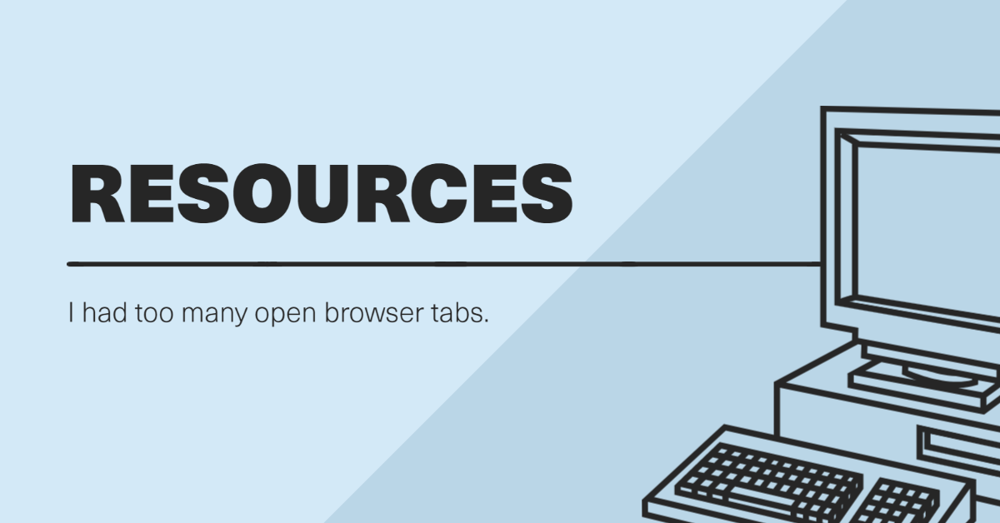

---
output:
  github_document:
    toc: true
    toc_depth: 1
---

```{r banner, echo=FALSE}

```

-----

<!-- README.md is generated from README.Rmd. Please edit the Rmd file, as edits to the md file will be overwritten! -->

```{r setup, include = FALSE, echo=FALSE}
knitr::opts_chunk$set(
  collapse = TRUE,
  echo = FALSE,
  message = FALSE,
  warning = FALSE,
  comment = "#>"
)
```

<!-- Badges begin -->

<!-- Badges end -->

I'll do my best to keep this organized but I apologize if it's perhaps a little untidy. If you feel like something should be added, go ahead and do a pull request and I'll check it out. You may find the occasional affiliate link.

# Graphics and Design

+ [Make Images, Videos and Web Stories for Free in Minutes | Adobe Spark](https://spark.adobe.com/sp/)
+ [Stock photos, royalty-free images, graphics, vectors & videos | Adobe Stock](https://stock.adobe.com/)
+ [Canva: Collaborate & Create Amazing Graphic Design for Free](https://www.canva.com/)
+ [Beautiful Free Images & Pictures | Unsplash](https://unsplash.com/)
+ [Artlist - Royaly Free Music Licensing For VideosMusic Licensing For Video](https://artlist.io/)
+ [Krita | Digital Painting. Creative Freedom.](https://krita.org/en)
+ [Simple Icons | 1965 Free SVG icons for popular brands](https://simpleicons.org/)
+ [Browse Your Life in Pictures – PhotoPrism](https://photoprism.app/)
    + Privately hosted, open source photo organization tool (think Google Photos but local).
+ [DEVICON | All programming languages and development tools related icons font](https://devicon.dev/)

# R

Anything related to the R language, specifically.

+ [Live Updates and Bloggers from Data Science Community | RWeekly.org - Blogs to Learn R from the Community](https://rweekly.org/live)

## Learning and Teaching with R

+ [RStudio Education](https://education.rstudio.com/)
+ [An Introduction to R](https://intro2r.com/)
+ [Welcome | Data Science in a Box](https://datasciencebox.org/)
+ [Interactive Tutorials for R](https://rstudio.github.io/learnr/)
+ [rstudio/gradethis: Tools for teachers to use with learnr](https://github.com/rstudio/gradethis)
+ [Feed me back now: Tales of automated feedback in R and Python | feed-me-back](https://mine-cetinkaya-rundel.github.io/feed-me-back/)
+ [rfordatascience/tidytuesday: Official repo for the #tidytuesday project](https://github.com/rfordatascience/tidytuesday)
    + (This isn't instructive, per se, but it's a great resource for seeing just how others work.)
+ [Tidymodels: tidy machine learning in R](https://www.rebeccabarter.com/blog/2020-03-25_machine_learning/)
    + (A great walkthrough using `tidymodels`.)
+ [Welcome to Text Mining with R | Text Mining with R](https://www.tidytextmining.com/index.html)
+ [Telling Stories With Data](https://www.tellingstorieswithdata.com/)
+ [MAT381E/About-course: This repository involves Course info for MAT381E: Introduction to Data Science and some useful links for data sources available on the web.](https://github.com/MAT381E/About-course)
+ [The Mockup Blog: Displaying verbatim code chunks in RMarkdown and Xaringan presentations](https://themockup.blog/posts/2021-08-27-displaying-verbatim-code-chunks-in-xaringan-presentations/)

## Tools

+ [tidyverse/reprex: Render bits of R code for sharing, e.g., on GitHub or StackOverflow.](https://github.com/tidyverse/reprex)
+ [mwip/beautifyR: RStudio addin for formatting Rmarkdown tables](https://github.com/mwip/beautifyR)
+ [swsoyee/pagemapR: 📦 Quickly and easily add a mini map to web page](https://github.com/swsoyee/pagemapR)
+ [Download Qualtrics Survey Data • rOpenSci: qualtRics](https://docs.ropensci.org/qualtRics/)
+ [dreamRs/shinyWidgets: shinyWidgets : Extend widgets available in shiny](https://github.com/dreamRs/shinyWidgets)
+ [r-lib/waldo: Find differences between R objects](https://github.com/r-lib/waldo/)
+ [HTML Metadata Tags for R Markdown and Shiny • metathis](https://pkg.garrickadenbuie.com/metathis/)
+ [R-CoderDotCom/calendR: Ready to print calendars with ggplot2](https://github.com/R-CoderDotCom/calendR#further-customization)
+ [yonicd/details: R Package to Create Details HTML Tag for Markdown and Package Documentation](https://github.com/yonicd/details)
+ [emitanaka/edibble: An R-package to construct designs using the grammar of experimental design](https://github.com/emitanaka/edibble)
+ [MilesMcBain/datapasta: On top of spaghetti, all covered in cheese....](https://github.com/milesmcbain/datapasta)
+ [Call R from R • callr](https://callr.r-lib.org/)
+ [stla/findInFiles: Find a pattern in some files.](https://github.com/stla/findInFiles)
+ [progressr 0.8.0: RStudio's progress bar, Shiny progress updates, and absolute progress](https://www.jottr.org/2021/06/11/progressr-0.8.0/)
+ [Extract text from pdf in R and word Detection » finnstats](https://finnstats.com/index.php/2021/06/15/extract-text-from-pdf-in-r-and-word-detection/)
+ [ConviviaR Tools: Post-Publication Collecting ORCIDs for the Authors](https://dwayzer.netlify.app/posts/2021-06-28-post-publication-collecting-orcids-for-the-authors/)
+ [ConviviaR Tools: Importing Author Information from CrossRef to Wikidata via QuickStatements](https://dwayzer.netlify.app/posts/2021-07-02-importing-author-information-from-crossref-to-wikidata-via-quickstatements/)
+ [Generate QRcodes with R • qrcode](https://thierryo.github.io/qrcode/index.html)


## Project management

+ [dlab-berkeley/RStudio-Project-Management: Resources to help you start managing data science projects.](https://github.com/dlab-berkeley/RStudio-Project-Management)
+ [A Framework for Reproducible and Collaborative Data Science • workflowr](https://jdblischak.github.io/workflowr/index.html)
+ [Reproducible Research Data and Project Management in R](https://annakrystalli.me/rrresearchACCE20/index.html)
+ [GitHub workflow for data science project proposals](http://www.citizen-statistician.org/2020/11/github-workflow-for-data-science-project-proposals/)
    + Related to [IDS](https://www.introds.org/) and [Welcome | Data Science in a Box](https://datasciencebox.org/)
+ [RealityBending/TemplateResults: A template for a data analysis folder that can be easily exported as a webpage or as Supplementary Materials](https://github.com/RealityBending/TemplateResults)
+ [startyourlab/r-project-template: A template to start R projects with R Studio, using version control via Git and GitHub by default.](https://github.com/startyourlab/r-project-template)

## RMarkdown

+ [papaja: Reproducible APA manuscripts with R Markdown](http://frederikaust.com/papaja_man/)
+ [A rmarkdown Template that Can be Highly Customized • memor](https://hebrewseniorlife.github.io/memor/)
+ [GerkeLab/betterposter: Another R Markdown Better Scientific Poster](https://github.com/GerkeLab/betterposter)
+ [Introducing the flipdownr package. Create a CountDown in Rmarkdown Documents and Shiny Apps | Mohamed El Fodil IHADDADEN](https://ihaddadenfodil.com/post/introducing-the-flipdownr-package-create-a-countdown-in-rmarkdown-documents-and-shiny-apps/)
+ [feddelegrand7/GomoGomonoMi: 👑 Animate Text in Rmd documents and shiny using the Animate.css Library](https://github.com/feddelegrand7/GomoGomonoMi)
+ [R Markdown Template for Responses to Reviewers • respondR](https://pjbouchet.github.io/respondR/index.html)
+ [rstudio/rticles: LaTeX Journal Article Templates for R Markdown](https://github.com/rstudio/rticles)
    + [Pakillo/rticles-examples: Examples of rendered PDF articles produced from Rmarkdown templates in rticles package](https://github.com/Pakillo/rticles-examples)
    + [Chapter 13 Journals | R Markdown: The Definitive Guide](https://bookdown.org/yihui/rmarkdown/journals.html)
+ [dpprdan/rmdwiki: Wiki Markup Output Formats and Templates for RMarkdown](https://github.com/dpprdan/rmdwiki)
+ [deepanshu88/summaryBox: Value and Info Boxes in Shiny Apps and Rmarkdown (Bootstrap 4)](https://github.com/deepanshu88/summaryBox)
+ [Inserting pages from an external PDF document within a LaTeX document](http://blog.bharatbhole.com/inserting-pages-from-an-external-pdf-document-within-a-latex-document/)
    + (This works in RMarkdown files.)
+ [Getting Started with R Markdown](https://ourcodingclub.github.io/tutorials/rmarkdown/#insert)
+ [Embed Video in HTML • vembedr](https://ijlyttle.github.io/vembedr/index.html)
+ [dreamRs/gfonts: Offline Google Fonts for rmarkdown and shiny](https://github.com/dreamRs/gfonts)
+ [eddelbuettel/linl: Linl Is Not Letter -- Markdown-based LaTeX Letter Template](https://github.com/eddelbuettel/linl)
+ [Another Academic R Markdown Article/Manuscript Template | Steven V. Miller](http://svmiller.com/blog/2020/09/another-rmarkdown-article-template/)
+ [cynkra/indiedown: Individual RMarkdown Templates](https://github.com/cynkra/indiedown)
+ [carpentries/glosario: A multilingual glossary package.](https://github.com/carpentries/glosario)
+ [Is Your Code Ready for Publication? A Practical Guide to R Markdown](https://www.jvcasillas.com/rmd_workshop/index.html#1)


### Xaringan-specific

+ [xaringanExtra](https://pkg.garrickadenbuie.com/xaringanExtra/#/)
+ [Professional, Polished, Presentable](https://presentable-user2021.netlify.app/)

## Visualization

Tables, figures, EDA, et cetera.

+ [htmlwidgets for R - gallery](http://gallery.htmlwidgets.org/)
+ [Introduction to metricsgraphics](http://hrbrmstr.github.io/metricsgraphics/)
+ [rstudio/r2d3: R Interface to D3 Visualizations](https://github.com/rstudio/r2d3)
+ [davidgohel/flextable: table farming](https://github.com/davidgohel/flextable)
+ [arthurwelle/codehover: Hoverable HTML Table for Displaying Intermediary Code Results (e.g. Pipes)](https://github.com/arthurwelle/codehover/)
+ [erikgahner/awesome-ggplot2: A curated list of awesome ggplot2 tutorials, packages etc.](https://github.com/erikgahner/awesome-ggplot2)
    + (A huge, truly awesome list.)
+ [Axes (ggplot2)](http://www.cookbook-r.com/Graphs/Axes_(ggplot2)/#axis-labels-and-text-formatting)
+ [Graphics in R with ggplot2 - Stats and R](https://statsandr.com/blog/graphics-in-r-with-ggplot2/#axis-ticks)
+ [rolkra/explore: R package that makes basic data exploration radically simple (interactive data exploration, reproducible data science)](https://github.com/rolkra/explore)
+ [feddelegrand7/cronologia: 🌱 🌱 🌱 Create an HTML Vertical Timeline Widget in RMarkdown and Shiny](https://github.com/feddelegrand7/cronologia)
+ [rstudio/gt: Easily generate information-rich, publication-quality tables from R](https://github.com/rstudio/gt)
+ [Collapsible Tree: Geography Example](https://adeelk93.github.io/collapsibleTree/)
+ [slickR Basics](https://cran.r-project.org/web/packages/slickR/vignettes/basics.html)
+ [Make ggplot2 Graphics Interactive • ggiraph package](https://davidgohel.github.io/ggiraph/index.html)
+ [daattali/timevis: 📅 Create interactive timeline visualizations in R](https://github.com/daattali/timevis#readme)
+ [Easily Arrange External Figures with Patchwork Alongside ggplot2 Figures • figpatch](https://bradyajohnston.github.io/figpatch/)


# Statistics

+ [Discovering Statistics – The adventure begins …](https://www.discoveringstatistics.com/)
+ [homepage | Stats Video Textbook](https://bryankoenig.wixsite.com/statsvideotextbook)
+ [Stats and R](https://statsandr.com/)
+ [Statistics glossary - Google Docs](https://docs.google.com/document/d/1dsiubZK689KwdiVj2Uv0vLAGkV_BtCuaEIOgg_BaGm8/edit#heading=h.3ajbdlewhre5)

# Git

+ [Introduction to GitHub | GitHub Learning Lab](https://lab.github.com/githubtraining/introduction-to-github)

# Scholarship

General scholarship content, like research advice, how to cite, find funding opportunities, and so on.

## Writing and Doing Research

+ [How to do Graduate Research, Some Advice](https://www.ece.rutgers.edu/~cps/assets/extras/HowToDoResearch_ANRG_WP02001.pdf)
+ [8 Finding a Topic and Beginning Research](https://www.cs.umd.edu/~oleary/gradstudy/node9.html)

## Project Management

+ [The PARA Method: A Universal System for Organizing Digital Information - Forte Labs](https://fortelabs.co/blog/para/)
+ [Create a dynamic dashboard with R, flexdashboard, and Shiny | Andrew Heiss](https://www.andrewheiss.com/blog/2020/01/01/flexdashboard-dynamic-data/)
    + (The successor to the original [dashboard to show the status of the pipeline](https://twitter.com/andrewheiss/status/1201892963451842562), based on [Matt Lebo’s “Managing Your Research Pipeline”](https://doi.org/10.1017/S1049096516000160).)
+ [Documenting your projects on GitHub · GitHub Guides](https://guides.github.com/features/wikis/)

## Citation

+ [papaja: Reproducible APA manuscripts with R Markdown](http://frederikaust.com/papaja_man/)
    + (It's important enough that it's here *and* in the R section.)
+ [Reference List: Author/Authors // Purdue Writing Lab](https://owl.purdue.edu/owl/research_and_citation/apa_style/apa_formatting_and_style_guide/reference_list_author_authors.html)

## Surveys

+ [Sending Respondents a Copy of their Survey - Qualtrics Tutorials - LibGuides at Kent State University](https://libguides.library.kent.edu/qualtrics/response-reports)

## Funding Opportunities

+ [Research Grants on Education: Small | The Spencer Foundation](https://www.spencer.org/grant_types/small-research-grant)

## Peer review

+ [Ten simple rules for writing a response to reviewers](https://journals.plos.org/ploscompbiol/article?id=10.1371/journal.pcbi.1005730)
    + (Related to `respondR`)

# Communication

+ [Teamflow - Feel like a team again | Virtual Office Space](https://www.teamflowhq.com/)
    + [Their public roadmap kanban board.](https://airtable.com/shrTZ3T2M7AMJ9ZJF/tblyX8IE5T7V8BzKu)

# Security and Privacy

## General

+ [PrivacyTools - Encryption Against Global Mass Surveillance](https://privacytools.io/)
    + (Big collection of privacy tools ranging from providers, browsers, software, operating systems, and more.)

+ [Sign Git Commits With A Keybase GPG Key – Stephen's Thoughts](https://stephenreescarter.net/signing-git-commits-with-a-keybase-gpg-key/)
+ [ExifCleaner - FREE Desktop app to clean image metadata](https://exifcleaner.com/)
+ [Pixelfed - Federated Image Sharing](https://pixelfed.org/)
    + (Privacy-focused, federalized Instagram replacement.)
+ [Giving social networking back to you - Mastodon](https://joinmastodon.org/)
+ [jivoi/awesome-ml-for-cybersecurity: Machine Learning for Cyber Security](https://github.com/jivoi/awesome-ml-for-cybersecurity)

## File storage and sharing

+ [canton7/SyncTrayzor: Windows tray utility / filesystem watcher / launcher for Syncthing](https://github.com/canton7/SyncTrayzor)
+ [🧅 OnionShare](https://onionshare.org/)
    + ("an open source tool that lets you securely and anonymously share files, host websites, and chat with friends using the Tor network.")

## Collaboration

+ [CryptPad: Collaboration suite, encrypted and open-source](https://cryptpad.fr/)
    + (Has fully encrypted alternatives for Google Drive, surveys, Slack teams, and so on.)
+ [Turtl: The secure, collaborative notebook | Turtl](https://turtlapp.com/)
    + (Can be used to save bookmarks and whatnot with the browser extension.)

## Network

+ [Mullvad VPN - Privacy is a universal right](https://mullvad.net/en/)

# Mixed Reality

+ [Matterport: Capture, share, and collaborate the built world in immersive 3D](https://matterport.com/)
+ [Build mixed reality digital twins with Azure Digital Twins and Unity - Learn | Microsoft Docs](https://docs.microsoft.com/en-us/learn/paths/build-mixed-reality-azure-digital-twins-unity/?wt.mc_id=AID3034732_QSG_EML_NLTR_535611&ocid=AID3034732_QSG_EML_NLTR_535611#msdynttrid=frqFGqwf-Rq_ZwiP1IyZKam19SthJ235QA8xP9vuvpc)
+ [Volumetric Video Capture Booth | Capture HD Static & Dynamic 3D Models](https://mantis-vision.com/3d-studio-3iosk/)
+ [Home | XR Access Initiative](https://xraccess.org/)
+ [Making VR a Reality in the Classroom | EDUCAUSE](https://er.educause.edu/articles/2021/4/making-vr-a-reality-in-the-classroom?m_i=QtSCd1kwMt4ufLb31pY2T4iKbEMKe1ssE%2BDz_jkqp%2BH7jTCTry5MLwunOB3PCXcohU_u6yUmNer0ShG7XwPOg0GxVSl0b%2BBQQ_&M_BT=2225012242)

# Podcasting

+ [Headliner - Promote your podcast, radio show or blog with video](https://www.headliner.app/)

# Streaming

## Streamlabs OBS

+ [The Essential Toolkit for Pro Streamers | Streamlabs Prime](https://streamlabs.com/goprime?promo=ma%7Bvr%7Dxlab-5f2e-10)
+ [How to Live Stream Your Classroom for Teachers | Streamlabs](https://streamlabs.com/content-hub/post/how-to-live-stream-your-classroom-for-teachers)
+ [How to Record on Streamlabs OBS (Best Settings for 2021) | by Ethan May | Streamlabs Blog | Streamlabs Blog](https://blog.streamlabs.com/how-to-record-on-streamlabs-obs-best-settings-for-2020-62697e078ae)
+ [How to Stream VR Games With Streamlabs | Streamlabs](https://streamlabs.com/content-hub/post/how-to-stream-vr-games-with-streamlabs)

# Fun

+ [DOOM Captcha - Captchas don't have to be boring](https://vivirenremoto.github.io/doomcaptcha/)

------

# License

<!-- CC license begin -->
<p xmlns:cc="http://creativecommons.org/ns#" xmlns:dct="http://purl.org/dc/terms/"><a property="dct:title" rel="cc:attributionURL" href="https://github.com/ryanstraight/resources/">Resources</a> by <a rel="cc:attributionURL dct:creator" property="cc:attributionName" href="https://ryanstraight.com">Ryan Straight</a> is licensed under <a href="http://creativecommons.org/licenses/by-nc-sa/4.0/?ref=chooser-v1" target="_blank" rel="license noopener noreferrer" style="display:inline-block;">Attribution-NonCommercial-ShareAlike 4.0 International<br /></a></p>
<!-- CC license end -->
